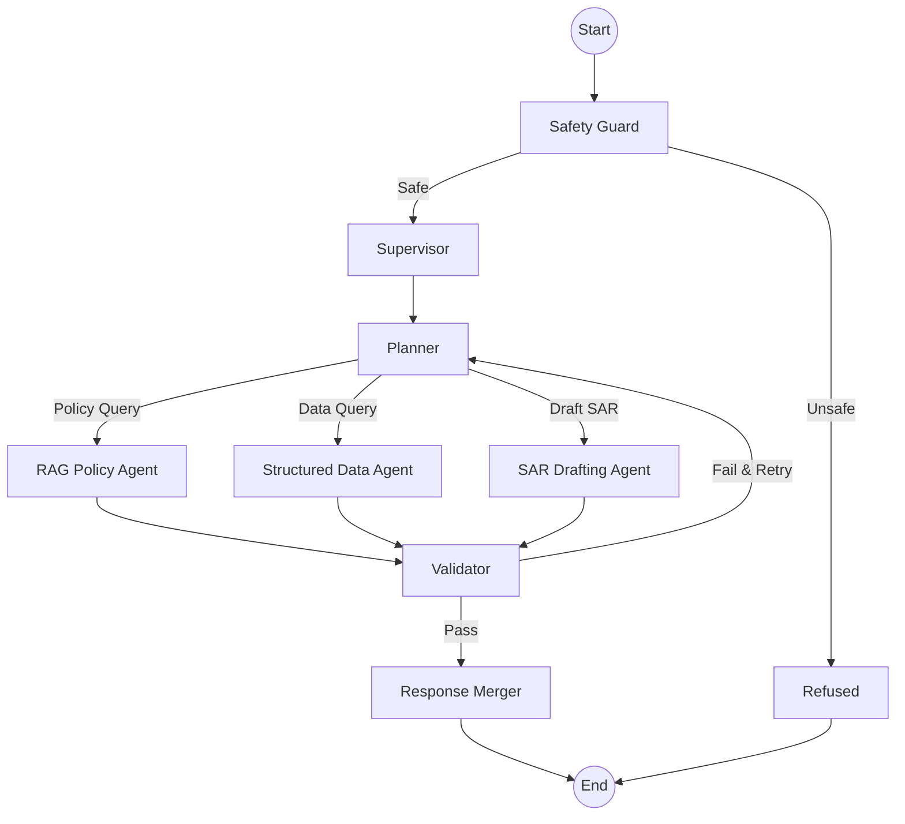

# 🛡️ CrimeShield AI

**The Economic Crime Intelligence Engine for Lloyds Bank**

CrimeShield AI is a production-grade, multi-agent intelligence assistant designed for the Lloyds Bank economic crime prevention team. It automates complex compliance workflows, identifies financial crime patterns, and assists in regulatory reporting with a focus on safety, accuracy, and auditable reasoning.

---

## 🚀 Key Features

- **Advanced RAG Pipeline** — High-precision retrieval using **HyDE** (Hypothetical Document Embeddings), **Hybrid Search** (Dense + Sparse), and **BERT Reranking**.
- **xAI Grok Integration** — Orchestrated by **Grok-3** for sophisticated reasoning, policy analysis, and SAR drafting.
- **Multi-Agent LangGraph** — An 8-node state machine that handles planning, validation, and deterministic routing.
- **Structured Data Intelligence** — Agentic tool-calling to query alerts and typology thresholds directly from SQL-like DataFrames.
- **Automated SAR Drafting** — Generates structured Suspicious Activity Reports (SARs) grounded in bank alert data.
- **Safety & PII Controls** — Multi-stage safety guard with regex-based blocklists and active PII redaction.

---

## 🏗️ Architecture: The 8-Node Brain

CrimeShield uses **LangGraph** to manage the stateful interaction between specialized agents:



### Advanced Retrieval Pipeline (RAG)
The `rag_policy` agent implements a state-of-the-art retrieval strategy:
1.  **HyDE Expansion**: Generates a hypothetical answer to the query to improve embedding alignment.
2.  **Hybrid Search**: Simultaneously performs **Dense Cosine Similarity** (ChromaDB) and **Sparse BM25** (Keyword matching).
3.  **RRF Fusion**: Merges candidate lists using **Reciprocal Rank Fusion**.
4.  **BERT Reranker**: Final top-5 precision scoring using a local **Cross-Encoder**.

---

## 🛠️ Technology Stack

- **LLM**: xAI Grok (Grok-3, Grok-3-mini)
- **Frameworks**: LangChain, LangGraph, FastAPI
- **Database**: ChromaDB (Vector Store), Pandas (Structured Tables)
- **Embeddings**: `sentence-transformers/all-MiniLM-L6-v2`
- **Reranker**: `cross-encoder/ms-marco-MiniLM-L-6-v2`
- **UI**: Streamlit (Premium Dark Mode)

---

## ⚡ Quick Start

### 1. Environment Setup
```bash
# Clone and enter directory
cd hcl_hackathon

# Create virtual environment
python3 -m venv venv
source venv/bin/activate

# Install dependencies
pip install -r crimeshield/requirements.txt
```

### 2. Configure Credentials
Copy `crimeshield/.env.example` to `crimeshield/.env` and provide your **XAI_API_KEY**:
```bash
XAI_API_KEY=xai-...
```

### 3. Launch the Intelligence Assistant

**Run the Streamlit Dashboard (Recommended):**
```bash
# From the project root
streamlit run crimeshield/ui.py
```

**Run via CLI:**
```bash
python crimeshield/main.py "What are the red flags for Trade-Based Money Laundering?"
```

---

## 📋 Project Structure

```text
crimeshield/
├── agents/             # Logic for RAG, SAR, and Data agents
├── graph/              # LangGraph orchestration and shared state
├── pipeline/           # Data loading and vector store construction
├── prompts/            # Externalized YAML prompt configurations
├── utils/              # PII redaction, audit logging, and LLM factories
├── config.py           # Centralized configuration settings
├── main.py             # FastAPI and CLI entry point
└── ui.py               # Streamlit demo interface
```

---

## 🛡️ Safety & Auditing

Every interaction is tracked in `audit.log`. The system identifies and redacts:
- **PII**: Emails, Credit Card Numbers, IBANs, IP Addresses.
- **Unsafe Intent**: Evasion advice, control circumvention, or off-topic queries.
- **Low Confidence**: Responses below a similarity threshold are declined with a professional refusal message.

---

## ⚖️ License

Internal Use — Lloyds Banking Group Hackathon.
